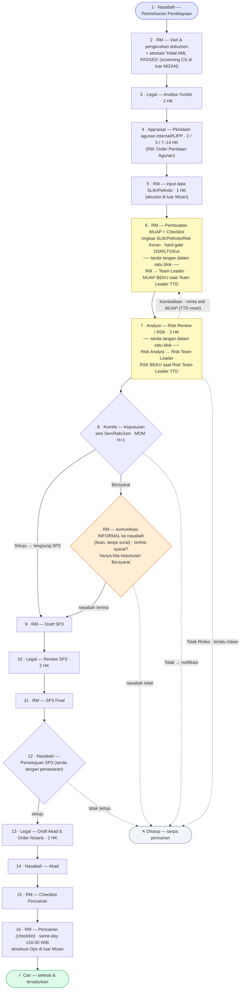

# MIZAN — Alur Kerja Target (linear, anchored on Hijra SOP slides)

- **Type:** design blueprint (confirmed target) · **Status:** Confirmed target — engine shipped 2026.06.04 (maker-checker · desks · Rapat); the 6→4/1→16 renumber is deferred-by-design (see `../CURRENT-STATE.md`) · **Last reviewed:** 2026.06.08
- **Provenance:** merged from `brainstorm/WORKFLOW-TARGET.md` (retired); anchored on Hijra SOP slides (`../references/sources/`).
- **Used by:** `../guides/workflow.md` (as-built; engine shipped 2026.06.04) and `../guides/alur-kerja-inti.md` (Bahasa Finance-confirmation companion of this target).
- **Review trigger:** Discovery W1 ratification of DPS-per-deal + BWMP.

> **GATE OPEN (human override 2026.06.03):** this RM-led 6→4 target — signature ladders folded into MUAP/RSK blocks (sejak 2026.06.12 dipersingkat jadi MUAP RM→Team Leader & RSK Risk Analyst→Risk Team Leader), SP3→Akad chain, Bersyarat informal-confirm-before-SP3 — is the **confirmed go-forward design**. The engine build shipped 2026.06.04 (maker-checker · desks · Rapat); the 6→4/1→16 renumber stays deferred-by-design (`../CURRENT-STATE.md`).

> **What this is.** The **target financing flow** as a **linear numbered sequence (1→16)** —
> drawn to mirror Hijra's own SOP slides (`sources/Hijra Bank Process - 1 Flow Proses
> Pembiayaan.jpeg` + `- 2 Flow by Detail.jpeg`, 2026-06-02; slide 2 is itself a numbered list).
> The maker-checker **signature ladders** (MUAP: RM→Team Leader; RSK: Risk Analyst→Risk
> Team Leader) are **folded INTO the document blocks** — not shown as separate stage boxes —
> so the diagram reads as one straight line.
>
> **Ladder dipersingkat — shipped 2026.06.12 — typecheck+unit+integration verified; live smoke pending.** MUAP = RM → Team Leader; RSK = Risk Analyst → Risk Team Leader. Engine as-built sudah menjalankan rantai 2 jenjang ini. Keputusan: [ADR-0021](../decisions/0021-two-rung-approval-chains.md).
>
> **Status: RANCANGAN TARGET — belum dibangun.** App still runs the as-built **5-stage** model —
> see [WORKFLOW.md](../references/workflow-detail.md) (as-built) + [BUILD-STATE.md](../CURRENT-STATE.md) §"Bank SOP fold".
> SOP facts transcribed in [HIJRA-BANK-SOP-DIGEST.md](../references/hijra-bank-sop-digest.md).

## Diagram alur (linear 1→16)

> Baca **dari atas (1) ke bawah (16)**. Garis penuh = alur maju; garis putus-putus = jalur
> tolak/tutup atau kembali ke pembuat. Blok kuning (6 MUAP, 7 RSK) = dokumen **berikut rantai
> tanda tangannya di dalam** (dibekukan saat TTD terakhir). Kotak oranye = konfirmasi nasabah
> untuk keputusan **Bersyarat** saja.

**Catatan baca:**
- **Langkah 3–4 (Legal · Appraisal)** **diorkestrasi RM secara paralel** (RM mengajukan ke tiap
  desk via Jira; hasilnya balik ke RM). **Langkah 5 (tarik SLIK/Pefindo)** dikerjakan **RM sendiri**
  (slide 2 checklist; Ops hanya pemilik **SLA sistem BI-Checking**, slide 4). Semua bermuara ke
  **langkah 6 (Pembuatan MUAP)** — pola **RM → desk → balik ke RM** dari slide 1.
- **Semua desk berkomunikasi lewat RM** (hub model, slide 3) — tidak ada desk-ke-desk.
- **Keputusan Komite (8):** **Setuju → langsung Draft SP3 (9)**. **Bersyarat → RM beri tahu nasabah
  INFORMAL dulu** (lisan, **tanpa surat**). Komunikasi informal ini **di luar sistem — TIDAK di-track app**;
  di state ini app cuma sediakan dua aksi RM: **lanjut → Draft SP3** (syarat dikomunikasikan **tertulis
  via SP3**) atau **tutup `nasabah-decline`** (nasabah tolak syarat). **Tolak → Ditutup.**
- **Persetujuan FORMAL nasabah hanya sekali = tanda tangan SP3 (langkah 12).** Komunikasi Bersyarat
  di RC bersifat informal/lisan tanpa surat; **SP3 adalah surat penawaran formal pertama**. Untuk
  Setuju, RC dilewati — nasabah langsung ke TTD SP3 (langkah 12).
- **Tipe akad = parameter proposal, MUTABLE pra-Komite** (Murabahah/Ijarah/Musyarakah/Mudharabah) —
  bukan konstanta intake. Bank boleh counter-offer (nasabah minta akad A, bank "bisa segini tapi akad B");
  perubahan akad/plafond/term pra-Komite = **revisi proposal** (RM, `+History`), **beku di keputusan Komite**,
  diformalkan **SP3 (langkah 12)**. Akad menyetir **konten** (metode DSR, istilah & tabel MUAP, treatment
  agunan, sudut Syariah +1S), **bukan urutan langkah** (alur 1→16 akad-agnostik). **Ubah akad setelah MUAP
  diteken ⇒ TTD batal ⇒ ladder ulang + dok wajib divalidasi ulang.** Detail: [`akad-types.md`](../references/akad-types.md);
  dok wajib per-akad: [`required-docs-matrix.md`](../references/required-docs-matrix.md). Prinsip proposal-vs-workflow: [`workflow-engine.md`](workflow-engine.md).
- **Gerbang Komite (8) = tunggal untuk semua plafond di V1.** **BWMP** (Batas Wewenang Memutus
  Pembiayaan — otoritas per tingkat plafond) **tiering** (plafond kecil skip Komite / otoritas lebih
  tinggi untuk plafond besar) = **V2** — keputusan sadar, bukan kelalaian. Detail tier & posture:
  [`komite-mechanics.md`](../references/komite-mechanics.md) §BWMP.

## Setia pada slide Hijra

- Owner per langkah persis slide 1: Nasabah · Marketing/RM · Legal & Appraisal · Analyst · Komite ·
  Operasional. Urutan **pasca-Komite** (SP3 → Review SP3 → SP3 Final → Persetujuan → Akad &
  Notaris → Akad → Checklist → Pencairan) persis slide 1.
- SLA per desk dari slide 4; sesi Komite Sen/Rab/Jum + MOM H+1 dari slide 2/4.

## Model peran & desk (SSOT)

> Sumber kebenaran model peran (engine shipped 2026.06.04) — **jangan duplikasi tabel ini di tempat lain**.

**Dua lapis izin (prinsip).** **Desk = izin granular (atomik)** — unit `hasDesk` terkecil.
**Role = komposisi desk** — satu jabatan = gabungan beberapa desk. **Prefer desk granular**
(pertahankan desk yang sudah ada bila masih masuk akal); memindah tugas antar-orang = **menyusun
ulang role**, bukan mengubah alur. **RM (Marketing) = hub** (slide 3): semua desk lewat RM.

### Lapis 1 — Desk (izin granular)

`Init` = cara tugas dimulai: **manual** atau **sistem-init** (auto-draft, lalu butuh **konfirmasi**
pemegang desk).

| Desk (izin) | Fungsi | Langkah | Init |
|---|---|---|---|
| `intake` | buat aplikasi · visit · doc-check · atestasi AML | 1–2 | manual |
| `biro-pull` | rekam data SLIK/Pefindo (akuisisi di luar Mizan) | 5 | manual |
| `muap-author` | 5C+1S + susun MUAP & checklist | 6 | AI-draft → konfirmasi |
| `legal` | Analisa Yuridis · Review SP3 · Draft Akad & Order Notaris | 3 · 10 · 13 | manual |
| `appraisal` | Penilaian agunan internal/KJPP | 4 | manual |
| `muap-approve-tl` | persetujuan MUAP (Team Leader) → **MUAP beku** | gerbang 6 | manual |
| `rsk-author` | susun RSK | 7 | AI-draft → konfirmasi |
| `rsk-approve-rtl` | persetujuan RSK (Risk Team Leader) → **RSK beku** | gerbang 7 | manual |
| `komite-schedule` | konfirmasi **jadwal** Komite | 8a | **sistem-init** → konfirmasi |
| `komite-content` | konfirmasi **konten/deck** Komite | 8b | **sistem-init** → konfirmasi |
| `komite-chair` (Ketua) | **set keputusan** per-app (Approved/Conditional+notes/Rejected+notes) + finalisasi MoM | 8 | manual |
| `komite-mom` | konfirmasi **MOM** Komite (maks H+1) | 8c | **sistem-init** → konfirmasi |
| `sp3-author` | draft + final SP3 | 9 · 11 | AI-draft → konfirmasi |
| `pencairan-checklist` | checklist pencairan (NAP · memo realisasi · draft transfer) → tandai Cair | 15–16 | manual |
| `mg` · `admin-*` | manajemen · konfigurasi | — | — |

> **Mekanisme keputusan Komite = REVISI (ADR-0005, 2026.06.04):** **TIDAK ada voting in-app.** Komite
> memutuskan di ruang rapat (daring/luring); Ketua mencatat outcome per-app; **MoM per-app yang
> ditandatangani QR oleh semua Komite hadir = artefak keputusan** (routing terjadi saat MoM final).
> Tanda tangan MoM = atestasi tak-berurut (bukan ladder); tanda-tangan pertama membekukan isi.
> Veto Risiko tetap struktural (app ber-`Reject` Risiko tak pernah masuk antrean Komite). Detail +
> model kehadiran/peserta: [`../decisions/0005-rapat-komite-signed-minutes.md`](../decisions/0005-rapat-komite-signed-minutes.md).

> Kode desk **indikatif** (target). Build **mempertahankan desk granular yang ada** bila masih masuk
> akal — penyetelan akhir di plan build. Tiga desk **dukungan Komite** (`komite-schedule`,
> `komite-content`, `komite-mom`) **wajib jadi izin terpisah**, **di-bundle ke role RM** (sejalan slide 2 yang menaruhnya di checklist RM) — tetap mudah dipindah / jadi role sendiri.

### Lapis 2 — Role (komposisi desk)

| Role | Desk yang di-bundle |
|---|---|
| **RM** — Relationship Manager (Marketing) | `intake` · `biro-pull` · `muap-author` · `komite-schedule` · `komite-content` · `komite-mom` · `sp3-author` · `pencairan-checklist` |
| **Team Leader** — Team Leader / Supervisor (MUAP) | `muap-approve-tl` |
| **Legal & Appraisal** | **`legal` + `appraisal`** — *dua desk, satu role* |
| **Risk Analyst** | `rsk-author` |
| **Risk Team Leader** — penyetuju RSK | `rsk-approve-rtl` |
| **CRO** | `komite-vote`/`komite-chair` |
| **Komite** — Rapat Komite | `komite-vote` · `komite-chair` |
| **MG / Admin** | `mg` · `admin-*` |

> **Penyetuju harus orang berbeda** (RM ≠ TL, RA ≠ RTL) dicek di lapis assignment.
> Token `MUAP §sig` & `RSK §IX` diisi dari ledger approval (lihat §"Aturan tetap").

**Di luar sistem Mizan (slide 3 — di-track sebagai checklist / info saja, RM maintain state):** **Ops**
(tarik SLIK/Pefindo langkah 5 · eksekusi Pencairan langkah 16) · **Finance** (Special Rate) ·
**Compliance** (Review Sharia — **beda** dari DPS) · **Penjaminan & Asuransi** · **CS** (AML/DTTOT/PEP —
atestasi RM langkah 2). Mizan **tidak mengorkestrasi** ini — hanya merekam info / checklist (RM).

## Aturan tetap (maker-checker)

- **Hard-gate memblokir** permintaan persetujuan (DSR/LTV/Kol auto-compute; **override = self-service**: alasan tercatat/auditable, **tanpa approval terpisah**). Persetujuan Team Leader **menegaskan** legal + biro ditinjau = "empat mata".
- **Tolak → kembali ke pembuat** (alasan wajib); rantai diulang saat kirim ulang.
- **Send-back lintas-domain: Risk Analyst → RM** — dua aksi: *Kembalikan untuk Perbaikan*
  (RM revisi, rantai MUAP diulang) & *Tolak Risiko* (`closeReason='risk-reject'`, tutup
  pra-Komite). Risk Team Leader hanya menolak **ke Risk Analyst**.
- **Penyetuju berbeda:** RM ≠ TL, RA ≠ RTL.
- **Persetujuan mengisi token tanda tangan** otomatis (ledger = sumber audit); **dokumen harus FINAL (semua TTD lengkap) sebelum maju** — MUAP (RM+Team Leader) **beku → naik ke Risk**; RSK (Risk Analyst+Risk Team Leader) **beku → masuk antrean Komite**.
- **Bentuk tanda tangan = QR internal Hijra (traceable)** — bukan e-meterai/sertifikat digital eksternal. Tiap aksi `approve`/sign menghasilkan **QR unik per (penandatangan × versi dokumen)**; discan → kembalikan **siapa** TTD & **kapan**. QR melekat ke versi dokumen yang ditandatangani (kirim-ulang pasca send-back = versi baru = QR baru); ledger `ApprovalStep` tetap sumber audit. Token **§sig/§IX diisi QR ini** (bukan sekadar teks nama+waktu).
- **Flag konflik CRO di Komite — DIHAPUS** (sejak ladder dipersingkat 2026.06.12, CRO tidak lagi
  menandatangani RSK, jadi flag COI `rskCroSignerUserId` dihapus dari kode; lihat
  [ADR-0021](../decisions/0021-two-rung-approval-chains.md)).
- **Tugas dukungan Komite di-init sistem** (8a jadwal · 8b konten · 8c MOM) lalu **dikonfirmasi
  pemegang desk** — di-bundle ke **role RM** (sejalan slide 2; desk tetap terpisah, mudah dipindah).

## Tambahan di luar slide (engineering + keputusan)

1. **Tanda tangan dilipat ke dalam blok dokumen** (2026-06-03) — ladder MUAP (RM→Team Leader) &
   RSK (Risk Analyst→Risk Team Leader) = blok tanda tangan dokumen yang sudah ada (MUAP §sig,
   RSK §IX), dijadikan gate nyata, **bukan** stage terpisah. Pembekuan dokumen di TTD terakhir.
2. **Ladder dipersingkat jadi 2 penandatangan** (2026.06.12) — MUAP **beku saat Team Leader TTD**
   (rung BM/KU dihapus); RSK **beku saat Risk Team Leader TTD** (rung Risk Officer, CRO, dan
   DPS-sebagai-penandatangan-RSK dihapus). **Risk Team Leader = posisi baru, analog risk-side dari
   Team Leader MUAP.** Penolakan terjadi **sebelum** pembekuan — tidak ada dokumen beku yang perlu
   dibuka. **Catatan:** DPS tetap sebagai **gerbang kepatuhan syariah Stage-5 terpisah** (opini DPS /
   `dps-review` / `rekomendasi_dps_or_tidak`) — itu **bukan** ladder RSK dan **tidak** dihapus.
   Keputusan + catatan migrasi: [ADR-0021](../decisions/0021-two-rung-approval-chains.md).
3. **Bersyarat → konfirmasi nasabah sebelum Draft SP3** (2026-06-03) — keputusan Bersyarat tidak
   langsung men-draft SP3; RM konfirmasi nasabah dulu (hemat tenaga). Lihat kotak RC + catatan baca.
4. **Atestasi AML oleh RM** (2026-06-02) — langkah 2; screening DTTOT/PEP/negative-list **di luar
   MIZAN** (CS). Lihat [COMPLIANCE.md](../references/compliance.md) + [WORKFLOW.md](../references/workflow-detail.md) §AML.
5. **Desk = in-system task owner** (Legal & Appraisal) — kerja desk masuk MIZAN (dilacak SLA + audit),
   **bukan** gating desk. **Ops & AML/CS di luar MIZAN** — RM cuma merekam info (langkah 5) / checklist (langkah 16).
6. **Dukungan Komite di-init sistem + konfirmasi desk** (2026-06-03, per human) — tiga tugas RM-side
   yang mengapit rapat dijadikan **langkah eksplisit**, masing-masing **di-init sistem** (auto-draft)
   lalu **dikonfirmasi pemegang desk**: **8a `komite-schedule`** (jadwal, sesi Sen/Rab/Jum) →
   **8b `komite-content`** (deck, `contoh_format_presentasi_komite`) → **[Komite — Keputusan]** →
   **8c `komite-mom`** (MOM, maks **H+1**, `contoh_format_mom`). Tiga desk **terpisah**, **di-bundle
   ke role RM** (sejalan slide 2) — mudah dipindah / jadi role sendiri.
7. **Desk vs Role** (2026-06-03, per human) — izin dimodelkan **granular per-desk**; **role =
   komposisi**. **Legal & Appraisal = dua desk (`legal`, `appraisal`) tetapi satu role.** Prefer
   mempertahankan desk granular yang ada; gabung di lapis role.
8. **Tanda tangan = QR internal Hijra** (2026-06-03, per human) — menutup pertanyaan keabsahan TTD.
   Mizan **tidak** pakai e-meterai/UU-ITE sertifikat digital; pakai **QR internal Hijra**, **unik per
   (penandatangan × versi dokumen)**, discan untuk mendapat penandatangan + timestamp (basic traceable
   signing). Dipakai di ladder MUAP/RSK (§sig/§IX) + dokumen internal (SP3, MOM). **Akad (langkah 14)
   tetap instrumen notaris terpisah** (di luar skema QR).
   **Token, identitas & verify = milik Mizan** (encode `qrToken`/ref `ApprovalStep` yang Mizan resolve;
   halaman verify internal `/qr/<token>`), **bukan** otoritas tanda-tangan / service QR eksternal Hijra
   (2026-06-04, per human). **Gambar QR** dirender via QR-render API eksternal yang **hanya** melihat URL
   verify opaque tanpa-PII (`insertInlineImage` tak bisa base64). Mekanisme render = SSOT
   [`document-system.md`](document-system.md) §Signing.

## 🔵 Titik yang masih perlu ditegaskan (W1)

**Ngaruh ke app (sisa):**
- **Angka SLA + ambang hard-gate (DSR/LTV/Kol, BWMP)** — **config**, bukan struktur. ⚠️ **W1 source-mining
  (2026-06-04):** angka ini **TIDAK ada** di dokumen proposal/sumber mana pun — butuh **RAC Pembiayaan
  Produktif + Pedoman Komite Hijra** di Discovery nyata (SLA per-desk + cadence Komite **sudah** dari slide 4).
  Verifikasi config = task di plan build. Detail: [`discovery-open-questions.md`](../references/discovery-open-questions.md).
- **Bersyarat — DIPUTUSKAN (2026-06-04):** syarat dikomunikasikan **tertulis via SP3**; konfirmasi informal
  nasabah **di luar sistem, tidak di-track**. App: lanjut → Draft SP3, atau tutup `nasabah-decline`.
  **Tidak ada artefak syarat terpisah.**
- **Jalur exception/terminal:** (a) **nasabah mundur** sebelum SP3 → `closeReason='nasabah-withdraw'` generik;
  (b) **SP3 kedaluwarsa** sebelum TTD → re-issue / tutup; (c) **akad no-show / reschedule** (langkah 14);
  (d) **SLA breach — DIPUTUSKAN (2026-06-04): V1 = projeksi + notif** (command eskalasi = V2). (a)–(c)
  sebagian V2; minimal `nasabah-withdraw` layak V1.
- **Artefak consent belum eksplisit:** SLIK ditarik di langkah 5 (di luar intake). **Surat Kuasa/
  Persetujuan BI-Checking** + **consent pemrosesan data (UU PDP)** kemungkinan nempel di Formulir
  Permohonan tapi belum jadi baris checklist tersendiri — confirm ditangkap di mana (gate vs embedded).
- **Pemenuhan syarat (Bersyarat) — DIPUTUSKAN (2026-06-04):** tidak di-track terpisah; syarat **menumpang
  SP3** (TTD SP3 = persetujuan syarat). Konfirmasi informal di luar sistem.
- **Segregation of duties di cabang kecil:** "penyetuju harus beda" sudah ada; kebijakan **overlap role**
  (satu orang banyak desk/role saat staff terbatas — sampai batas mana) perlu ditegaskan.

**Proses saja — TIDAK ngaruh ke app (klarifikasi akurasi, tak ubah kode):**
- **DPS review apa** (seluruh berkas vs aspek Syariah) — ini soal cakupan **gerbang kepatuhan syariah Stage-5 terpisah** (opini DPS / `dps-review`), **bukan** ladder RSK (DPS tidak lagi menandatangani RSK sejak 2026.06.12); jawabannya tak mengubah kode.
- **Legal & Appraisal satu tim atau dua** — app tetap **2 desk granular**; satu vs dua role = **config
  assignment**, tak ubah struktur/alur.

**Sudah diputuskan (bukan W1 lagi):**
- **Ops di luar sistem Mizan** — penarik SLIK/Pefindo (langkah 5) & eksekusi Pencairan (langkah 16) di
  luar Mizan; Mizan cuma tahu **RM punya data biro** (cara dapat / koordinasi Ops = urusan Hijra) &
  Pencairan = **checklist RM**.
- **Dukungan Komite (jadwal/konten/MOM) → role RM** (sejalan slide 2).
- **Penjaminan & Asuransi · Special Rate · Review Compliance** — **di luar Mizan**; di Pencairan hanya **checklist** (RM maintain state).
- **Tanda tangan = QR internal Hijra (traceable)** — lihat §"Aturan tetap" + §Tambahan #8; menutup pertanyaan keabsahan e-sign (bukan e-meterai).
- **SLA-breach V1 = projeksi + notif** (2026-06-04) — bukan command eskalasi (= V2).
- **Cutover: belum ada data prod live** (2026-06-04) — migrasi 6→4 = **reset/reseed**, bukan cutover; finish-on-old/checkpoint **moot** untuk V1.
- **Bersyarat: syarat via SP3, konfirmasi informal di luar sistem (tak di-track), RM boleh tutup `nasabah-decline`** (2026-06-04).
- **Send-back / reject Risk — DIPUTUSKAN (per human, 2026-06-04):** Risk Analyst punya **dua aksi**: (a)
  **Tolak Risiko (terlalu riskan) → Tutup `risk-reject`** (terminal, RM diberi tahu); (b) **Kembalikan →
  minta edit MUAP → balik ke langkah 6** (bukan tolak). **MUAP diedit ⇒ semua TTD batal ⇒ ladder
  RM→Team Leader mulai ulang** (versi MUAP naik, QR baru). Slide Hijra cuma happy-path; perilaku reject/send-back
  ini **inferensi+arahan kita** (W1-confirm via RAC), bukan dari slide.
- **QR: token/identitas/verify milik Mizan** (2026-06-04) — bukan otoritas TTD eksternal; **gambar** dirender
  via QR-render API eksternal (lihat URL opaque saja). Lihat §Tambahan #8 + `document-system.md` §Signing.
- Aturan tetap maker-checker (hard-gate memblokir, penyetuju berbeda RM≠TL & RA≠RTL,
  saran AI advisory) ada di §"Aturan tetap" + §"Model peran & desk" di atas.

## Template & artefak (sumber)

Dokumen yang dihasilkan/dipakai alur (engine penyusunan = Google Docs editable; beku → SeaweedFS):

| Artefak | Langkah | Sumber template |
|---|---|---|
| MUAP | 6 | `muap-template.md` (token §sig) |
| RSK | 7 | template RSK Hijra (§IX, kolom TTD; master + pemetaan slot Risk Team Leader di-update terpisah oleh pemilik template) |
| Deck Komite | 8b | `contoh_format_presentasi_komite` (Hijra) |
| MOM Komite | 8c | [MoM — Google Doc](https://docs.google.com/document/d/10XN9YnweIJO3k0LRIghJGXQ-jxcPkWKPNJSiUIkXHCM/edit) · `contoh_format_mom` |
| SP3 | 9 · 11 | [SP3 — Google Doc](https://docs.google.com/document/d/10jrneQ0gH-06aKiBSLJGar3OZ3yJ77_9Q6bR7sEfe10/edit) |
| NAP · memo realisasi · draft transfer · checklist pencairan | 14–16 | artefak Pencairan (slide 2 #14) |
