# Alur Kerja Inti Mizan — Dokumen Konfirmasi

> **Status: ALUR AS-BUILT — untuk konfirmasi Finance (engine shipped 2026.06.04).**
> Audiens: tim Finance / proses bisnis Hijra.
> Tujuan: menegaskan bahwa **alur kerja yang sudah dibangun** sesuai proses origination
> pembiayaan Hijra yang sebenarnya. (Konfigurasi finer — tier BWMP, kuorum Komite, scope
> DPS, SLA per-desk — masih menunggu ratifikasi Discovery W1.)
>
> ⚠️ **Versi ini di-anchor ke SOP asli Hijra (slide WhatsApp 2026-06-02).** Dokumen ini
> dulu menggambarkan model **4-tahap "RM menyerap semua desk"** (keputusan internal
> 2026.05.30). Slide SOP Hijra menunjukkan gambaran yang lebih tepat: RM (Marketing)
> **mengorkestrasi** desk **Legal & Appraisal** dan **Ops** — bukan menyerapnya. Yang
> dilebur ke RM hanya kerja **feasibility/5C+1S** (Loan Analyst lama). Alur target di
> bawah mengikuti **urutan 16-langkah** dari slide Hijra sendiri, dengan dua **rantai
> persetujuan maker-checker** dilipat ke dalam dokumen MUAP & RSK.
>
> 🏦 Sumber Bank: `docs/references/hijra-bank-sop-digest.md` (transkrip 5 slide) ·
> diagram kanonik (English): `docs/designs/workflow-target.md` · alur **as-built** hari
> ini (6-tahap): `docs/guides/workflow.md`.
>
> ⏳ **Catatan ratifikasi.** Fakta SOP di bawah berlabel 🏦 adalah **bukti kuat dari
> Bank** namun datang informal (WhatsApp), belum lewat Discovery W1. Mohon ditegaskan
> di W1 sebelum dikunci.

## Cara membaca dokumen ini

Ini menggambarkan proses **target** (yang akan dibangun), disusun **persis seperti urutan
slide SOP Hijra**. Mohon baca tiap langkah dan tegaskan: **"benar — memang begini proses
kami"** atau **"tidak — kami sebenarnya begini"**. Bila ada poin yang perlu diubah,
perubahan mengalir ke rencana + kode, bukan hanya ke dokumen ini.

Poin bertanda 🔵 adalah **titik yang paling perlu ditegaskan** — pilihan desain yang
sengaja diambil dan punya konsekuensi proses. Rangkumannya ada di bagian akhir.

**Dua lapis yang perlu dibedakan:**
- **Pemilik langkah (lane SOP):** siapa yang *mengerjakan* tiap langkah — Nasabah ·
  Marketing/RM · Legal & Appraisal · Analyst (Risk) · Komite · Operasional (Ops).
- **Gerbang persetujuan (maker-checker):** dua **rantai tanda tangan** yang menjadi
  *gerbang* nyata dan membekukan dokumen — bukan desk terpisah, melainkan blok tanda
  tangan **di dalam** MUAP (langkah 6) dan RSK (langkah 7).
- **Izin = Desk (granular); Role = komposisi.** Permission MIZAN dimodelkan per-**desk** (atomik),
  lalu digabung jadi **role**. Contoh: **Legal & Appraisal = dua desk tetapi satu role**.
  Tabel desk↔role lengkap: `docs/designs/workflow-target.md` §"Model peran & desk".

## Diagram alur (linear 1→16, sesuai slide Hijra)

```mermaid
flowchart TD
    S1([1 · Nasabah — Permohonan Pembiayaan])
    S2["2 · Relationship Manager — Visit & pengecekan dokumen<br/>+ atestasi 'Initial AML PASSED' (screening CS di luar MIZAN)"]
    subgraph GLEGAP ["👥 Role: Legal & Appraisal"]
      S3["3 · Analisa Yuridis · 2 HK"]
      S4["4 · Penilaian agunan internal/KJPP · 2 / 3 / 7–14 HK<br/>(RM: Order Penilaian Agunan)"]
    end
    S5["5 · Relationship Manager — input data SLIK/Pefindo · 1 HK<br/>(akuisisi di luar Mizan)"]
    S6["6 · Relationship Manager — Pembuatan MUAP + Checklist<br/>ringkas SLIK/Pefindo/Rek Koran · hard-gate DSR/LTV/Kol"]

    subgraph GMUAP ["🟡 Gerbang MUAP — rantai tanda tangan (langkah 6)"]
      direction LR
      MA["Relationship Manager<br/>(pembuat)"]
      MB["Team Leader<br/>(checker)<br/>→ MUAP BEKU"]
      MA -->|"minta persetujuan"| MB
      MB -.->|"tolak → ke pembuat"| MA
    end

    S7["7 · Risk Analyst — Risk Review / RSK · 3 HK"]

    subgraph GRSK ["🟡 Gerbang RSK — rantai tanda tangan (langkah 7)"]
      direction LR
      RA["Risk Analyst<br/>(pembuat)"]
      RRTL["Risk Team Leader<br/>(checker)<br/>→ RSK BEKU"]
      RA -->|"minta persetujuan"| RRTL
      RRTL -.->|"tolak → ke pembuat"| RA
    end

    subgraph GKOMITE ["⏱ SLA Komite — sesi Sen/Rab/Jum · MOM ≤ H+1"]
      S8a["8a · Jadwal Komite<br/>(sistem-init → konfirmasi)"]
      S8b["8b · Konten/Deck Komite<br/>(sistem-init → konfirmasi)"]
      S8{"8 · Komite Pembiayaan — Keputusan"}
      S8c["8c · MOM hasil Komite ≤ H+1<br/>(sistem-init → konfirmasi)"]
    end
    RC{"Relationship Manager — komunikasi INFORMAL ke nasabah<br/>(lisan, tanpa surat) · terima syarat?<br/>hanya bila keputusan Bersyarat"}
    S9["9 · Relationship Manager — Draft SP3"]
    S10["10 · Legal & Appraisal — Review SP3 · 2 HK"]
    S11["11 · Relationship Manager — SP3 Final"]
    S12{"12 · Nasabah — Persetujuan SP3 (tanda tangan penawaran)"}
    S13["13 · Legal & Appraisal — Draft Akad & Order Notaris · 2 HK"]
    S14["14 · Nasabah — Akad"]
    S15["15 · Relationship Manager — Checklist Pencairan"]
    S16["16 · Relationship Manager — Pencairan (checklist) · same-day ≤16:00 WIB<br/>eksekusi Ops di luar Mizan"]
    Cair([✓ Cair — selesai & tersalurkan])
    Tutup([✕ Ditutup — tanpa pencairan])

    S1 --> S2 --> S3 --> S4 --> S5 --> S6
    S6 -->|"MUAP draf siap"| MA
    MB -->|"MUAP BEKU"| S7
    S7 -->|"RSK draf siap"| RA
    RRTL -->|"RSK BEKU"| S8a
    S8a --> S8b --> S8
    RA -.->|"Kembalikan / Tolak Risiko → Relationship Manager"| S2
    S8 -->|"Setuju → langsung SP3"| S9
    S8 -->|"Bersyarat"| RC
    RC -->|"nasabah terima"| S9
    RC -.->|"nasabah tolak"| Tutup
    S8 -.->|"Tolak → notifikasi"| Tutup
    S8 -.->|"notulen ≤ H+1"| S8c
    S9 --> S10 --> S11 --> S12
    S12 -->|"setuju"| S13
    S13 --> S14 --> S15 --> S16 --> Cair
    S12 -.->|"tidak setuju"| Tutup

    style S1 fill:#e0e7ff,stroke:#4f46e5
    style Cair fill:#dcfce7,stroke:#16a34a
    style Tutup fill:#f1f5f9,stroke:#64748b
    style GMUAP fill:#fef9c3,stroke:#ca8a04
    style GRSK fill:#fef9c3,stroke:#ca8a04
    style RC fill:#ffedd5,stroke:#ea580c
    style S8a fill:#dbeafe,stroke:#2563eb
    style S8b fill:#dbeafe,stroke:#2563eb
    style S8c fill:#dbeafe,stroke:#2563eb
    style GKOMITE fill:#eef2ff,stroke:#6366f1,stroke-dasharray:5 5
    style GLEGAP fill:#ccfbf1,stroke:#0d9488
```

> Baca **dari atas (1) ke bawah (16)**. Dua kotak kuning = **gerbang tanda tangan
> maker-checker**, digambar sebagai **subgraph** agar jelas **siapa menandatangani &
> urutannya**: **pembuat → checker** (MUAP: RM → Team Leader; RSK: Risk Analyst → Risk Team Leader).
> Garis penuh = alur maju; garis putus-putus = tolak/tutup atau **kembali ke pembuat**.
> Dokumen **beku** di TTD terakhir (MUAP di Team Leader, RSK di Risk Team Leader). Kotak oranye = konfirmasi
> nasabah **informal** untuk keputusan **Bersyarat** saja.
>
> **Kotak teal = grup role** — langkah berbeda yang dipegang **satu role**. Contoh: **Legal &
> Appraisal** (langkah 3 Analisa Yuridis + langkah 4 Penilaian agunan) = **satu role**; role yang
> sama juga mengerjakan langkah **10 & 13**.
>
> **Kotak putus-putus indigo = grup kebijakan SLA** — semua langkah di dalamnya tunduk pada satu
> SLA. Contoh: cluster **Komite (8a · 8b · 8 · 8c)** = sesi Sen/Rab/Jum, MOM ≤ H+1. SLA satu-langkah
> tetap di label node (mis. Legal **2 HK** di langkah 3 · 10 · 13; Appraisal 2/3/7–14 HK; biro 1 HK).
>
> **Hub model (slide 3):** **semua desk berkomunikasi lewat RM** — tidak ada desk-ke-desk.
> Langkah **3–4 (Legal · Appraisal)** **diorkestrasi RM** (RM mengajukan via Jira; hasilnya balik
> ke RM); langkah **5 (SLIK/Pefindo)** ditarik **RM sendiri**. Semua bermuara ke MUAP (langkah 6).

## Empat fase gerbang (lensa maker-checker)

> **Ladder dua jenjang — shipped 2026.06.12; terverifikasi typecheck+unit+integration; smoke live menyusul.** MUAP = RM → Team Leader; RSK = Risk Analyst → Risk Team Leader. Keputusan + rasional: [ADR-0021](../decisions/0021-two-rung-approval-chains.md).

16 langkah di atas dikelompokkan menjadi empat fase, ditandai oleh **gerbang** dan
**keadaan terminal**:

| Fase | Langkah | Pemilik utama | Gerbang yang menutup fase |
| --- | --- | --- | --- |
| **A · Origination** | 1–6 | RM (orkestrasi Legal & Appraisal; tarik SLIK/Pefindo) | Rantai MUAP: RM → Team Leader → **MUAP beku** |
| **B · Kajian Risiko (RSK)** | 7 | Analyst (Risk) | Rantai RSK: Risk Analyst → Risk Team Leader → **RSK beku** |
| **C · Rapat Komite** | 8 | Komite | Voting kuorum + mayoritas → Setuju / Bersyarat / Tolak |
| **D · Pasca-Komite → Pencairan** | 9–16 | RM · Legal · Nasabah · Notaris | SP3 → Persetujuan nasabah → Akad → **Cair** |

## Rincian per langkah

Format: **Pemilik · Yang dikerjakan · Gerbang/Jalur · SLA Bank (slide 4)**. SLA dihitung
**hari kerja (HK)**, jam kerja **08:00–17:00 Sen–Jum**, dan mulai berjalan **"sejak
dokumen lengkap"** (bukan sejak masuk langkah).

### Fase A — Origination (langkah 1–6)

**1 · Nasabah — Permohonan Pembiayaan.** Nasabah mengajukan permohonan; RM membuat
aplikasi di MIZAN.

**2 · RM — Visit & pengecekan dokumen.** RM kunjungan, mengumpulkan & memverifikasi
dokumen wajib (lihat `docs/references/required-docs-matrix.md`), mengonfirmasi OCR.
- 🔵 **Atestasi AML oleh RM.** Screening **DTTOT / PEP / negative-list** dijalankan **CS
  di luar MIZAN** (slide 3); di MIZAN, RM menandai **"Initial AML PASSED"** sebagai
  atestasi. Tegaskan: benar AML dikerjakan CS di luar sistem, MIZAN hanya mencatat
  atestasi RM. SLA CS — AML: **1 HK**.

**3 · Legal — Analisa Yuridis.** Desk **Legal** menganalisa keabsahan/yuridis dokumen.
- 🔵 **Legal adalah desk terpisah yang diorkestrasi RM**, bukan dilebur ke RM. RM
  mengajukan (dulu via Jira), hasil balik ke RM. SLA Legal — Analisa Yuridis: **2 HK
  sejak dokumen lengkap**.

**4 · Appraisal — Penilaian agunan.** Desk **Appraisal** menilai agunan **internal** atau
lewat **KJPP**; RM memicu lewat **Order Penilaian Agunan**.
- 🔵 **Penilaian agunan adalah langkah eksplisit** (model 4-tahap lama tidak punya ini).
  **Pemilihan internal vs KJPP mengikuti aturan Hijra di luar Mizan** — Mizan hanya mencatat
  jalur/hasil yang dipakai. SLA Appraisal: **internal 2 HK** sejak visit; **KJPP 3 HK** (short
  report) / **7–14 HK** (long report).

**5 · RM — input data SLIK/Pefindo.** RM merekam data biro **SLIK** *dan* **Pefindo**, lalu mengisi
**Kolektibilitas (Kol)**.
- 🔵 **Ops di luar sistem Mizan.** Mizan **cuma tahu RM punya data biro** — apakah RM menariknya
  sendiri atau lewat Ops itu **urusan Hijra** (di luar Mizan). **Pefindo** (biro swasta) ikut SLIK
  (model lama hanya menyebut SLIK). SLA sistem BI-Checking (~1 HK) di luar lingkup Mizan.

**6 · RM — Pembuatan MUAP + Checklist.** RM menyusun **MUAP** + checklist dokumen,
meringkas **SLIK/Pefindo/Rek Koran**, mengisi analisa **5C+1S** + data finansial.
- 🔵 **5C+1S/feasibility adalah kerja RM (di dalam MUAP)** — *inilah* satu-satunya desk
  yang dilebur ke RM (Loan Analyst lama). "Analyst" di slide Hijra = **Risk** (langkah 7),
  bukan analis kelayakan terpisah.
- 🔵 **Ringkasan biro lewat AI bersifat advisory.** Sistem boleh meringkas SLIK/Pefindo/Rek
  Koran ("fineksi"), tetapi **tidak pernah** menjadi angka/keputusan otoritatif — RM
  mengonfirmasi eksplisit.
- 🔵 **DSR/LTV/Kol dihitung di sini dan menjadi HARD-GATE.** Bila ambang terlampaui
  (DSR >40%, LTV >70%, Kol >1), RM **tidak dapat meminta persetujuan** kecuali memberi
  **alasan override**. **Override = self-service (untuk sekarang):** RM menulis alasan yang
  **tercatat (auditable)** lalu lanjut sendiri — **tanpa approval terpisah**. *(Berubah dari model
  lama yang memperlakukan hard-gate sebagai sinyal, bukan penghalang.)*
- **🟡 GERBANG MUAP (rantai persetujuan 1):** RM **minta persetujuan** → **Team Leader**
  setuju. Penyetuju harus orang **berbeda** (RM ≠ TL). Persetujuan Team Leader
  **menegaskan** legal + biro telah ditinjau (inilah "empat mata"). **MUAP harus FINAL (kedua TTD RM + Team Leader lengkap) sebelum bisa naik ke Risk Analyst.** Saat **Team Leader**
  menyetujui: **MUAP dibekukan** dan token tanda tangan (`nama_rm`/`tanggal_ttd_rm`,
  `…_tl_spv`) terisi otomatis dari catatan persetujuan; berkas maju ke langkah 7.
- **Jalur kembali:** Team Leader dapat **menolak → kembali ke RM** dengan
  **alasan wajib**. Rantai diulang dari awal saat RM mengirim ulang.

### Fase B — Kajian Risiko / RSK (langkah 7)

**7 · Analyst — Risk Review / RSK.** Desk **Analyst (Risk)** meninjau hard-gate, menyusun
**RSK**, dan memberi **rekomendasi risiko** di dalam RSK (Setuju / Bersyarat / Tolak).
- 🔵 **Saran AI bersifat advisory saja** — Risk Analyst yang memilih eksplisit.
- **🟡 GERBANG RSK (rantai persetujuan 2):** Risk Analyst **minta persetujuan** → **Risk
  Team Leader** **menandatangani RSK**. Penyetuju berbeda (RA ≠ RTL — Risk Analyst ≠ Risk
  Team Leader).
- 🔵 **Risk Team Leader menandatangani SETIAP RSK (per-deal)** — penyetuju **terakhir** rantai,
  bukan review bersyarat. Saat **Risk Team Leader** menandatangani: **RSK dibekukan** dan token
  §IX (`rsk_sig_analyst_*`, `…_rtl_*`) terisi otomatis. **RSK harus FINAL (TTD Analyst → Risk
  Team Leader lengkap) sebelum masuk antrean Rapat Komite.** Karena RSK baru beku setelah
  ladder penuh, **penolakan Risk Team Leader terjadi sebelum pembekuan** — tak ada RSK beku
  yang perlu dibuka. SLA Risk: **3 HK (18 jam)**; antrian (queue).
- **Jalur kembali (dalam rantai):** Risk Team Leader dapat **menolak →
  kembali ke Risk Analyst** dengan alasan wajib.
- 🔵 **Jalur kembali ke RM (escape Risk Analyst).** Risk Analyst dapat memantulkan berkas
  **keluar ke RM** dengan **dua aksi berbeda** (alasan wajib):
  - **"Kembalikan untuk Perbaikan"** — RM merevisi MUAP lalu mengirim ulang; rantai
    **Team Leader diulang dari awal** (MUAP berubah).
  - **"Tolak Risiko"** — RM mengomunikasikan penolakan ke nasabah dan **menutup pengajuan
    SEBELUM Komite** (`closeReason = 'risk-reject'`).
  - Risk Team Leader hanya menolak **ke Risk Analyst**; hanya Risk Analyst yang
    memantulkan keluar ke RM.

### Fase C — Rapat Komite (langkah 8)

**8 · Komite — Keputusan.** Berkas masuk agenda → ketua memfinalisasi **Setuju / Bersyarat / Tolak**.
> **Administrasi sidang = RM (desk `komite-admin`, ADR-0015 / Batch 8).** RM yang bikin/konfirmasi/
> batalkan/atur ulang sidang **dan koreksi kehadiran riil** (drop anggota no-show sebelum MoM ditandatangani,
> supaya MoM tidak deadlock). Komite minim kerja: cek materi, **ketua** catat keputusan (chair-only),
> hadirin QR-sign MoM. RM **bukan** anggota roster / penanda-tangan wajib. (Catatan: bahasa "voting" di
> bawah ini warisan pra-ADR-0005 — keputusan kini = MoM ber-tanda-tangan, bukan voting in-app.)
- 🔵 **Tugas dukungan Komite di-init sistem + konfirmasi desk** (🏦 slide 2 #8–10): tiga tugas yang
  mengapit rapat, masing-masing **di-draft sistem** lalu **dikonfirmasi pemegang desk** (izin terpisah):
  - **8a · Jadwal Komite** — sesi **Senin / Rabu / Jumat**.
  - **8b · Konten/Deck Komite** — template `contoh_format_presentasi_komite`.
  - **8c · MOM/notulen** — **maks H+1** setelah rapat, [template MoM](https://docs.google.com/document/d/10XN9YnweIJO3k0LRIghJGXQ-jxcPkWKPNJSiUIkXHCM/edit).
  Desk konfirmasi **terpisah**, **di-bundle ke RM** (sejalan slide 2 yang menaruh ketiganya di checklist RM); tetap **mudah dipindah** ke role lain / role sendiri.
- **Aturan voting:** kuorum ⌈jumlah peserta × 2/3⌉; keputusan dengan **mayoritas >50%**
  dari suara yang masuk; ketua ditetapkan per-rapat dan memfinalisasi setelah kuorum +
  mayoritas terpenuhi.
- 🔵 **Pembekuan dokumen sudah terjadi lebih awal.** MUAP beku di persetujuan Team Leader
  (langkah 6) dan RSK saat **Risk Team Leader menandatangani** (langkah 7). Pada keputusan Komite,
  sistem tetap membuat **checkpoint audit** (PDF beku + kebijakan hard-gate saat itu +
  `contentHash` SHA-256) disimpan **on-prem di SeaweedFS** (bukan Postgres, bukan Google
  Drive); Doc Google yang *bisa diedit* tetap di Drive sebagai mesin penyusunan.

| Keputusan Komite | Tujuan |
| --- | --- |
| **Setuju** | **Langsung Draft SP3** (langkah 9) |
| **Bersyarat** | RM **konfirmasi nasabah INFORMAL** dulu (lisan, tanpa surat): terima → Draft SP3; tolak → **Ditutup** |
| **Tolak** | RM notifikasi nasabah → **Ditutup** (`committee-reject`) |

- 🔵 **Bersyarat → konfirmasi informal SEBELUM SP3.** Untuk keputusan **Bersyarat**, RM
  mengomunikasikan syarat ke nasabah secara **lisan/informal (tanpa surat)**. Komunikasi
  informal ini **di luar sistem — TIDAK dicatat/di-track MIZAN**, dan **tidak ada artefak
  syarat terpisah**. Di state ini app hanya menyediakan **dua aksi RM**: **lanjut → Draft SP3**
  (`ProceedToSp3`) bila nasabah **terima** — syaratnya dituangkan **tertulis lewat SP3** (SP3 =
  surat penawaran formal pertama); atau **tutup `nasabah-decline`** (`Close`) bila nasabah
  **tolak**. Aksi yang dipilih RM itulah satu-satunya jejak di MIZAN — bukan respons informalnya.
  Menunggu nasabah terima dulu menghemat tenaga (SP3 tak disusun sebelum syarat diterima).
  Keputusan tetap tercatat **"Bersyarat"** untuk audit, tidak diubah menjadi "Setuju".
  *(Untuk Setuju, langkah RC dilewati — langsung ke SP3.)*

### Fase D — Pasca-Komite → Pencairan (langkah 9–16)

Urutan pasca-Komite ini **persis slide 1 Hijra** (SP3 → Review SP3 → SP3 Final →
Persetujuan → Akad & Notaris → Akad → Checklist → Pencairan).

**9 · RM — Draft SP3.** RM menyusun **SP3** (Surat Penawaran/Persetujuan Pembiayaan) — [template SP3](https://docs.google.com/document/d/10jrneQ0gH-06aKiBSLJGar3OZ3yJ77_9Q6bR7sEfe10/edit).
**10 · Legal — Review SP3.** Desk Legal mereview draft SP3. SLA: **2 HK**.
**11 · RM — SP3 Final.** RM memfinalisasi SP3 setelah review Legal.
**12 · Nasabah — Persetujuan SP3.** Nasabah **menandatangani** SP3.
- 🔵 **Persetujuan FORMAL nasabah hanya sekali = tanda tangan SP3.** Komunikasi Bersyarat
  (langkah RC) bersifat informal/lisan; **SP3 adalah surat penawaran formal pertama.**
  Nasabah **setuju** → langkah 13; **tidak setuju** → **Ditutup** (`nasabah-decline`).
**13 · Legal — Draft Akad & Order Notaris.** Desk Legal menyusun akad + memesan notaris.
SLA: **2 HK**.
**14 · Nasabah — Akad.** Penandatanganan akad pembiayaan.
**15 · RM — Checklist Pencairan.** RM melengkapi checklist (mis. NAP, memo realisasi,
draft transfer dana). Tombol "Cair" terkunci sampai seluruh syarat terpenuhi.
**16 · RM — Pencairan (checklist).** Mizan menandai **Cair** setelah checklist lengkap; **eksekusi
pencairan oleh Ops di luar Mizan** (same-day jika dokumen lengkap ≤ 16:00 WIB; RTGS/Kliring ikut bank penampung). → **Cair**.
- 🔵 **Item di luar sistem Mizan = checklist saja.** **Penjaminan & Asuransi** (Ops), **Special Rate**
  (Finance), dan **Review Compliance/Syariah** ada **di luar Mizan**; Mizan cuma menyediakan **checklist**
  yang **state-nya dijaga RM** — bukan langkah yang diorkestrasi sistem.
- **Keadaan akhir:** **Cair** → aplikasi selesai & dana tersalurkan.

### Keadaan akhir "Ditutup" (terminal)
- 🔵 Selain **Cair**, aplikasi punya keadaan akhir **Ditutup** — berakhir **tanpa**
  pencairan, karena: Risk Analyst "Tolak Risiko" (pra-Komite), Komite **Tolak**, nasabah
  menolak syarat **Bersyarat** (informal), atau nasabah tidak menandatangani **SP3**.
  Aplikasi yang Ditutup **keluar dari papan pipeline aktif** namun tetap dapat dibuka di
  halaman detail (audit-first), dan jam SLA-nya berhenti.

## Desk di luar sistem Mizan (slide 3)

Slide 3 menampilkan desk/fungsi yang **di luar lingkup app Mizan** — Mizan **tidak mengorkestrasi**-nya;
paling jauh **di-track sebagai checklist** (state dijaga RM):
- **Ops (Operasional)** — tarik SLIK/Pefindo (langkah 5) & eksekusi Pencairan (langkah 16); Mizan cuma rekam **RM punya data biro** + **checklist Pencairan** (cara dapat / koordinasi Ops = urusan Hijra).
- **Finance — Special Rate** (pengecualian margin/pricing) — di luar Mizan.
- **Compliance — Review Sharia + konfirmasi ketentuan** — **beda** dari **DPS** (Dewan Pengawas Syariah — gerbang kepatuhan syariah terpisah, bukan rung ladder RSK); di luar Mizan.
- **Penjaminan & Asuransi** (Ops) — di luar Mizan; checklist di Pencairan.
- **CS — DTTOT/PEP/Negative-list (AML)** — di luar Mizan (atestasi RM, langkah 2).

## Titik yang perlu ditegaskan (rangkuman 🔵)

1. **Hub model, desk diorkestrasi RM — bukan diserap.** RM (Marketing) memimpin & menjadi
   hub komunikasi, tetapi **Legal & Appraisal** (yuridis/agunan) dan **Ops** (Pencairan) tetap
   **desk terpisah**. Yang dilebur ke RM hanya **feasibility/5C+1S**; SLIK/Pefindo ditarik RM sendiri.
   **Ini koreksi struktur paling penting vs versi 4-tahap sebelumnya.**
2. **"Analyst" = Risk** — di slide Hijra lane Analyst mengerjakan **Risk Review**, bukan
   analis kelayakan terpisah.
3. **Atestasi AML oleh RM** (langkah 2); screening DTTOT/PEP/negative-list di **CS, di luar
   MIZAN**.
4. **Appraisal/agunan + Pefindo eksplisit** — penilaian agunan (internal/KJPP) langkah 4 (desk
   Appraisal); SLIK **dan** Pefindo direkam **RM** langkah 5 (**Ops di luar Mizan**).
5. **Hard-gate MEMBLOKIR permintaan persetujuan** (DSR ≤40%, LTV ≤70%, Kol ≤1) — override
   hanya dengan alasan tercatat.
6. **Dua rantai persetujuan dilipat ke dalam dokumen** — MUAP (RM→Team Leader, langkah 6)
   & RSK (Risk Analyst→**Risk Team Leader**, langkah 7). Tiap persetujuan **mengisi
   tanda tangan** otomatis; penyetuju terakhir **membekukan dokumen**.
7. **Risk Team Leader menandatangani setiap RSK (per-deal)** — penyetuju terakhir RSK; RSK beku saat
   Risk Team Leader tanda tangan; Risk Team Leader tolak → Risk Analyst (sebelum pembekuan).
8. **Penyetuju harus orang berbeda** di tiap rantai (RM≠TL, RA≠RTL — Risk Analyst≠Risk Team Leader).
9. **Tolak → kembali ke pembuat** (RM atau Risk Analyst) dengan alasan wajib; rantai
   diulang. Risk Analyst boleh **"Tolak Risiko" → tutup pra-Komite** (`risk-reject`).
10. **Saran/ringkasan AI advisory** — tidak pernah menjadi angka/keputusan otoritatif.
11. **Bersyarat → konfirmasi nasabah INFORMAL sebelum SP3**; persetujuan **formal** nasabah
    hanya sekali = **tanda tangan SP3** (langkah 12).
12. **Rantai SP3 → Akad → Pencairan** pasca-Komite (langkah 9–16) mengikuti slide 1 Hijra:
    SP3 (RM) → Review (Legal) → Final (RM) → Persetujuan nasabah → Draft Akad & Notaris
    (Legal) → Akad (nasabah) → Checklist (RM) → Pencairan (Ops).
13. **SLA Bank-actual per-desk** (slide 4), hari kerja 08:00–17:00 Sen–Jum, mulai "sejak
    dokumen lengkap": Risk 3 HK · Legal 2 HK/tugas · Appraisal 2/3/7–14 HK · BI-Checking/Pefindo
    1 HK (di luar Mizan) · Pencairan same-day ≤16:00 (Ops, di luar Mizan) · CS AML 1 HK · Komite Sen/Rab/Jum, MOM H+1.
14. **Dukungan Komite di-init sistem + konfirmasi desk** — 8a Jadwal · 8b Konten/Deck · 8c MOM
    (≤H+1) di-draft sistem, lalu dikonfirmasi pemegang **desk terpisah** → **di-bundle ke RM** (sejalan slide 2; mudah dipindah).
15. **Izin granular per-desk, role = komposisi** — mis. **Legal & Appraisal = 2 desk, 1 role**.
    Prefer pertahankan desk granular; gabung di lapis role. Tabel lengkap di design SSOT.

## Keadaan akhir

| Keadaan | Bagaimana tercapai |
| --- | --- |
| **Disetujui & Cair** | Komite Setuju (atau Bersyarat + nasabah terima informal) → SP3 ditandatangani → Akad → "Cair" |
| **Bersyarat (menunggu respons)** | Komite Bersyarat → RM menunggu konfirmasi informal nasabah |
| **Ditutup — penolakan risiko** | Risk Analyst "Tolak Risiko" (langkah 7) → RM notifikasi nasabah → Tutup (`risk-reject`) — sebelum Komite |
| **Ditutup — penolakan Komite** | Komite Tolak → RM notifikasi nasabah → Tutup (`committee-reject`) |
| **Ditutup — nasabah menolak** | Nasabah tolak syarat Bersyarat (informal) **atau** tidak menandatangani SP3 → Tutup (`nasabah-decline`) |
