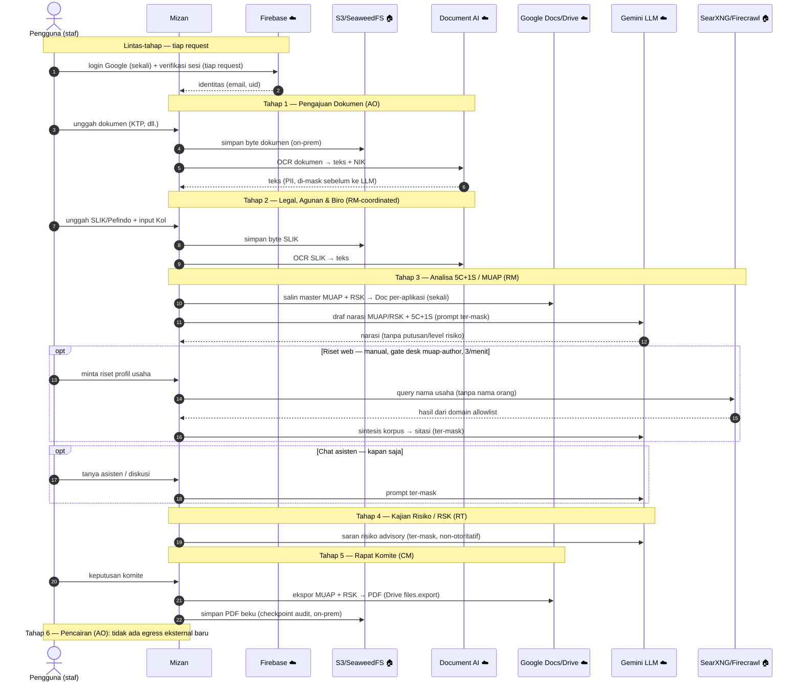

# Layanan Eksternal & Aliran Data — Dokumen Compliance

> Status: Current — inventaris egress (menunggu sign-off Tech/Compliance)
> Audiens: tim Teknologi / Compliance
> Tujuan: inventaris **egress** — layanan apa yang dipakai, fungsinya, dan **data
> apa yang keluar** dari infrastruktur Hijra.
> Catatan kepatuhan (gerbang G1–G5): **dicermin, bukan didefinisikan ulang** di
> sini. Sumber-kebenaran gerbang compliance = `../references/compliance.md`.

## Ringkasan

- Layanan dipisah jelas: **on-prem / self-hosted** vs **cloud eksternal**.
- **Tidak ada** analytics, error-tracking, atau observability pihak ketiga
  (Sentry/GlitchTip/Datadog/Mixpanel dll). Logging hanya JSON terstruktur ke
  stdout (`server/log.ts`), **tanpa PII** (hanya id + outcome).
- Seluruh boundary layanan **dapat ditukar lewat env** (provider seam) — tanpa
  perubahan kode.

## Tabel inventaris egress

| Layanan | Penyedia | Fungsi | Data yang dikirim | Lokasi |
| --- | --- | --- | --- | --- |
| **Gemini (LLM)** | Google Cloud | Inferensi teks: narasi MUAP/RSK, chat/diskusi, saran risiko advisory | Prompt **ter-mask** (nama/NIK/telepon/usaha → placeholder) | ☁️ Eksternal |
| **Document AI** | Google Cloud | OCR dokumen (KTP, SLIK, slip gaji, appraisal) | **Byte dokumen mentah** ke prosesor OCR khusus | ☁️ Eksternal (region dapat `asia-southeast1`) |
| **Google Docs / Drive** | Google Cloud | Pembuatan dokumen MUAP/RSK per-aplikasi | Narasi ter-mask (nama di-unmask oleh sistem, bukan model) | ☁️ Eksternal |
| **Firebase Auth** | Google Cloud | Login (Google OAuth) + sesi | Email + profil akun Google | ☁️ Eksternal |
| **PostgreSQL** | Self-hosted (Docker) | State aplikasi + jejak audit | Seluruh data relasional (kolom PII) | 🏠 On-prem |
| **SeaweedFS / S3** | Self-hosted (Docker) | Penyimpanan byte dokumen + **PDF beku MUAP/RSK** (checkpoint keputusan) | Byte file mentah (KTP, SLIK, dll.) + PDF keputusan | 🏠 On-prem |
| **SearXNG** | Self-hosted (Docker) | Meta-search riset web | String query (**nama orang sudah di-strip**) | 🏠 On-prem* |
| **Firecrawl** | Self-hosted (Docker) | Scrape/ekstraksi halaman | URL (allowlist) → markdown | 🏠 On-prem |

\* SearXNG meneruskan query ke mesin pencari publik → ada egress query ke
internet saat riset web aktif (lihat §"Perlu dilakukan").

## Kapan tiap layanan dipakai — alur per tahap

Pemetaan egress ke **tahap workflow** (lihat `alur-kerja-inti.md` untuk alur
bisnisnya). ☁️ = cloud eksternal, 🏠 = on-prem.



### Tabel acuan: kapan & untuk apa

| Layanan | Kapan (pemicu) | Untuk apa | Egress |
| --- | --- | --- | --- |
| **Firebase Auth** | Login + **tiap request** | Identitas & verifikasi sesi | ☁️ |
| **S3 / SeaweedFS** | **Tiap unggah dokumen** (semua tahap) | Simpan byte dokumen | 🏠 |
| **Document AI** | **Tiap unggah dokumen** (S1 KTP · S2 SLIK · S3 slip/appraisal · dst.) | OCR → teks + ekstraksi NIK | ☁️ |
| **Google Docs/Drive** | **Masuk Tahap 3** (sekali) | Salin master MUAP+RSK → Doc per-aplikasi | ☁️ |
| **Gemini — narasi** | **Masuk Tahap 3** | Draf narasi MUAP/RSK + 5C+1S | ☁️ |
| **Gemini — chat** | Kapan saja analis bertanya | Asisten/diskusi | ☁️ |
| **SearXNG/Firecrawl** | Tahap 3, **manual** (gate `muap-author`, 3/menit) | Riset profil usaha (badan usaha saja) | 🏠→publik |
| **Gemini — sintesis riset** | Setelah riset web | Rangkum korpus → sitasi | ☁️ |
| **Gemini — advisory** | Tahap 4 | Saran risiko (non-otoritatif) | ☁️ |
| **Google Drive — ekspor PDF** | **Keputusan Komite (Tahap 5)** | Ekspor MUAP+RSK → PDF (`files.export`) untuk dibekukan | ☁️ (baca) |
| **S3 / SeaweedFS — PDF beku** | **Keputusan Komite (Tahap 5)** | Simpan PDF checkpoint audit (immutable) | 🏠 |

> Catatan akurasi: OCR (Document AI) **tidak terikat satu tahap** — ia jalan
> setiap kali dokumen diunggah, di tahap mana pun (best-effort; kegagalan tidak
> pernah memblokir unggah). Pembuatan Doc MUAP+RSK terjadi **sekali** saat masuk
> Tahap 3. Riset web hanya jalan bila **diaktifkan** (lihat §"Perlu dilakukan")
> dan **dipicu manual** oleh Loan Analyst, bukan otomatis.

## Rincian per layanan eksternal

### Gemini (LLM) — lihat §"Catatan khusus LLM" di bawah untuk data egress detail
- **Fungsi:** menyusun draf narasi MUAP/RSK, menjawab chat/diskusi analis, dan
  memberi *saran risiko advisory* (tidak pernah otoritatif).
- **Kendali:** `INFERENCE_PROVIDER` (default `gemini`), `GEMINI_MODEL`.
- **Auth:** **Vertex saja** — `GOOGLE_CLOUD_PROJECT` (+ `GOOGLE_CLOUD_LOCATION`).
  Jalur AI Studio (`GEMINI_API_KEY`) **sudah dihapus 2026.06.08** (menghilangkan
  footgun silent-precedence). Kredensial Vertex *value-based* (pola sama Document AI):
  `VERTEX_CREDENTIALS` (base64 SA JSON, role `roles/aiplatform.user`) → fallback
  `FIREBASE_SERVICE_ACCOUNT` → ADC. SA khusus `mizan-vertex@hijra-mizan`. Region default
  `asia-southeast1` (Singapura, APAC); region luar-APAC **termasuk `global`** kini
  **diizinkan** tapi mengeluarkan WARN `ai.region_out_of_apac` — interim yang diterima
  (egress PII keluar APAC; tinjau ulang sebelum prod / 17 Des 2026, OJK §27). Tidak lagi
  fail-closed.

### Document AI (OCR)
- **Fungsi:** transkripsi dokumen + ekstraksi NIK dari KTP. Mengirim **byte
  dokumen mentah** ke prosesor OCR khusus (bukan model generatif). Hanya teks
  hasil ekstraksi yang mengalir ke hilir, dan **di-mask** sebelum ke Gemini.
- **Kendali:** `OCR_PROVIDER` (**default `stub`** = offline; produksi diaktifkan
  ke `documentai` lewat env), `DOCUMENTAI_LOCATION` (mis. `asia-southeast1` untuk
  residensi data Indonesia), `DOCUMENTAI_PROJECT_ID`, `DOCUMENTAI_PROCESSOR_ID`.

### Google Docs / Drive
- **Fungsi:** menyalin master template → mengisi NamedRange dengan narasi per
  aplikasi (MUAP/RSK). Konten narasi sudah ter-mask; nama nyata dimasukkan
  kembali **oleh sistem** (dari catatan Hijra), bukan oleh model.
- **Auth:** OAuth lewat akun Google khusus Mizan (bukan Gmail pribadi seseorang).
- **Pembekuan keputusan (Tahap 5):** Drive dipakai hanya untuk **mengekspor** Doc →
  PDF (`files.export`); PDF beku itu lalu **disimpan on-prem di SeaweedFS** (bukan
  diarsipkan di Drive, bukan di Postgres). Doc yang bisa diedit tetap di Drive.

### Firebase Auth
- **Fungsi:** login Google OAuth, pencetakan & verifikasi sesi (cookie httpOnly).
- **Data:** email akun Google (harus user desk terdaftar) + UID. Custom claims
  (role/desk) dikendalikan server.

## Riset web (SearXNG + Firecrawl) — contoh penggunaan & batas egress

Agen riset (`server/research/agent.ts`) menyusun rencana sub-pertanyaan, lalu
classifier egress (`lib/research/classifier.ts`) membentuk **query yang aman**.
Query bersifat **deterministik** (bukan dikarang LLM) demi auditabilitas OJK.

### Kapan riset DITOLAK total (fail-closed)
- **Nasabah perorangan** (`nasabahType !== 'business'`) → **tidak ada egress sama
  sekali**. Termasuk usaha milik perorangan (sole-proprietor) — nama pemilik/
  direktur adalah data pribadi menurut UU PDP. Analis isi catatan riset manual.
- **Nama usaha kosong** → tidak ada query.
- **PII terstruktur lolos** ke kandidat query (NIK/telepon/email/NPWP) → query
  dibuang; bila tak ada yang tersisa → ditolak.

### Query yang dibentuk (hanya untuk nasabah BADAN USAHA)
Untuk tiap aplikasi badan usaha, classifier membentuk sampai 4 query — **selalu
mengikat nama usaha (dalam tanda kutip), tidak pernah nama orang**:

| # | Pola query | Tujuan |
| --- | --- | --- |
| 1 | `"<nama usaha>" perusahaan profil` | Profil perusahaan |
| 2 | `"<nama usaha>" akta pendirian Kemenkumham` | Registri legal (AHU/Kemenkumham) |
| 3 | `"<nama usaha>" SIUP NIB OSS` | Izin usaha (OSS) |
| 4 | `"<nama usaha>" <tujuan pembiayaan, max 80 char>` | Anchor sektor + tujuan |

**Contoh konkret** — nama usaha `PT Berkah Tani Nusantara`, tujuan `modal kerja
pengadaan pupuk`, query yang dikirim ke SearXNG:
```
"PT Berkah Tani Nusantara" perusahaan profil
"PT Berkah Tani Nusantara" akta pendirian Kemenkumham
"PT Berkah Tani Nusantara" SIUP NIB OSS
"PT Berkah Tani Nusantara" modal kerja pengadaan pupuk
```

### Domain hasil yang diterima (allowlist)
Hanya hasil dari domain otoritatif yang disimpan; sisanya dibuang:
`ahu.go.id`, `kemenkumham.go.id`, `oss.go.id`, `ojk.go.id`, `idx.co.id`,
`bps.go.id`, plus pers tier-1: `kompas.com`, `tempo.co`, `kontan.co.id`,
`cnbcindonesia.com`, `bisnis.com`. Firecrawl hanya men-scrape URL allowlist ini.

> **Ringkas egress riset web:** yang keluar = nama usaha + istilah sektor/izin +
> tujuan pembiayaan. Yang **tidak pernah** keluar = nama orang, NIK, telepon,
> email, NPWP, dan apa pun untuk nasabah perorangan.

## 🔴 Catatan khusus LLM (Gemini) — data apa yang kami kirim

Ini bagian terpenting untuk compliance. Setiap panggilan ke Gemini melewati
**seam egress terpusat** (`server/ai/redact.ts`) dengan pertahanan berlapis:

1. **Mask-in (sebelum egress).**
   - Field dikenal → placeholder: nama nasabah → `[NASABAH]`, nama usaha →
     `[USAHA]`, NIK → `[NIK]`, telepon/WhatsApp → `[TELEPON]`, email.
   - Mask level-token untuk nama orang (≥4 karакter) agar referensi sebagian
     tertangkap, sadar-batas-kata (mis. "Budi" ≠ "Budidaya").
   - Pola umum via regex: NIK 16-digit, NPWP bertitik, telepon Indonesia
     (+62/0/landline), email.
2. **Detektor residual PII (kebijakan dapat dikonfigurasi).** Setelah mask, teks
   dipindai lagi. Hanya *label* yang dikembalikan, tidak pernah nilainya (aman
   untuk log: `pii.residual_detected`). Reaksinya diatur `PII_RESIDUAL_BLOCK`
   (`server/ai/redact.ts`): **default fail-OPEN** — dicatat tetapi teks (sudah
   ter-mask) tetap dikirim, agar demo tidak terblokir (keputusan 2026.06.04).
   Set `PII_RESIDUAL_BLOCK=1` untuk **fail-closed** (egress diblokir: narasi gagal
   deterministik, riset di-drop, chat/advisory/bureau melempar error) — **wajib
   sebelum data nasabah nyata di produksi (G2/G5).**
3. **Narrative-scrub.** Membuang field draf-AI yang menyatakan **putusan**
   (disetujui/ditolak/layak) atau **level risiko** (tinggi/sedang/rendah). Skema
   respons untuk jalur narasi **tidak punya** field level/recommendation — model
   secara struktural tidak bisa mengembalikannya.
4. **Unmask-out.** Nilai asli dimasukkan kembali ke output **oleh sistem**
   (exact-match dari catatan Hijra), bukan oleh model — mencegah halusinasi nama.
5. **Audit.** Prompt + reply disimpan **dalam keadaan ter-mask saja**
   (`server/ai/audit.ts`) — tidak pernah PII mentah.

### Data yang DIKIRIM ke Gemini (sudah ter-mask)
- Identitas → placeholder (`[NASABAH]`/`[USAHA]`/`[NIK]`/`[TELEPON]`).
- **Data bisnis/finansial TIDAK di-mask** (ini bukan PII identitas): plafond,
  tenor, DSR%, LTV%, pelanggaran hard-gate, penghasilan bersih bulanan,
  kewajiban berjalan, nilai appraisal agunan.
- Teks analisa 5C+1S, teks hasil OCR dokumen (ter-mask), kutipan riset web
  (entitas-usaha saja; nama orang sudah di-strip lebih dulu).

### 🔴 Risiko residual yang DITERIMA (disampaikan jujur, bukan ditutupi)
Masking = **bracket + regex, TANPA NER** (Named-Entity Recognition). Konsekuensi:
**nama orang sembarang di teks bebas** (narasi 5C, chat analis, teks hasil OCR)
yang **bukan** field dikenal **tidak ter-redaksi** sebelum ke Gemini, dan nama
hasil halusinasi model tidak ditandai. Ini adalah risiko yang **secara sadar
diterima**; NER + kill-switch pra-egress (G2) + penanda nama-halusinasi
**ditangguhkan** ke versi mendatang (lihat `docs/references/ai-ml-deferred.md`).

## Gerbang kepatuhan (G1–G5) — cermin, bukan duplikat

Sumber-kebenaran: `../references/compliance.md`. Pemetaan ke sisi aplikasi:

| Gerbang | Ringkas | Status sisi-app |
| --- | --- | --- |
| **G1** | Masking PII sebelum egress LLM | ✅ Dibangun (bracket+regex) |
| **G2** | Pemindaian/kill-switch PII pra-egress | ⏳ Detektor residual ada (default fail-open; `PII_RESIDUAL_BLOCK=1` → fail-closed); NER ditangguhkan |
| **G3** | Audit prompt ter-mask | ✅ Dibangun (narasi + chat) |
| **G4** | Antarmuka provider yang dapat ditukar | ✅ Dibangun (seam env) |
| **G5** | DPA vendor LLM | 🚫 Blocker Bank Legal (di luar lingkup app) |

## 🔧 Perubahan yang perlu dilakukan (dicatat, BELUM dikerjakan)

Keputusan diambil untuk **menulis dokumen lebih dulu**; perubahan kode menyusul.
Dokumen di atas sudah menggambarkan **postur produksi yang dituju**; kondisi kode
**saat ini** berbeda pada dua titik berikut:

1. **Riset web jadi selalu nyala.** Saat ini opt-in/mati secara default
   (`WEB_RESEARCH_PROVIDER` default `stub`; worker hanya jalan bila
   `RESEARCH_WORKER_ENABLED=1`). Target: aktif secara default untuk produksi.
   - 🔴 **Implikasi egress:** query (nama orang sudah di-strip) akan **selalu**
     keluar ke mesin pencari publik lewat SearXNG. Istilah usaha/lokasi tetap
     keluar. Postur egress ini perlu ditegaskan sebagai *intended* saat
     perubahan kode dikerjakan.
2. **Hapus OCR fallback Gemini Vision.** Provider `OCR_PROVIDER=gemini`
   (`server/ocr/gemini-vision.ts`) mengirim **gambar KTP mentah ke model
   generatif** — bukan untuk produksi. Target: hapus jalur ini; Document AI tetap
   menjadi engine OCR. Menghapusnya **mengurangi** permukaan risiko egress.

> Saat perubahan ini dikerjakan, perbarui §"Tabel inventaris" dan §"Rincian"
> agar cocok dengan kode, lalu hapus bagian §"Perlu dilakukan" ini.
